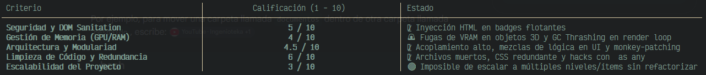

Se ha realizado una auditoría exhaustiva de la totalidad del código fuente del proyecto ( src/ ,  public/ ,  index.html , etc.). A continuación se presenta el
  diagnóstico técnico desglosado en Vulnerabilidades y Fugas de Memoria, Código "Espagueti" y Acoplamiento, Ambigüedades y Redundancias, Crítica Arquitectónica y
  un Análisis de Escalabilidad y Buenas Prácticas.
  ──────
  ## 📊 Resumen Ejecutivo y Evaluación General

  ## 1. Vulnerabilidades de Seguridad y Fugas de  Memoria

  ### A. Vulnerabilidad DOM XSS (Inyección de HTML)

  En collectibles.ts, los badges HTML flotantes se instancian utilizando  innerHTML  concatenando directamente las propiedades del objeto  Collectible :

    el.innerHTML = `◆ data.ascii < spanstyle = "font - size:11px;opacity:0.9;" >{data.name}`;

  • Riesgo: Si en el futuro los nombres o caracteres ASCII de los ítems provienen de una base de datos, backend de inventario, o mods creados por usuarios,
  cualquier payload con tags como  ``  se ejecutará arbitrariamente en el navegador del cliente.
  • Solución: Utilizar  textContent  o utilidades de desinfección (Sanitization /  DOMPurify ).

____
  ### B. Fugas de Memoria en GPU / VRAM (Memory Leaks en Three.js)

  En collectibles.ts, cuando el jugador recolecta un objeto 3D:

    useGameStore.getState().addCollectible(item.data);
    item.element.remove();
    this.scene.remove(item.group);
    this.activeItems.splice(i, 1);

  • Problema: Se remueve el grupo de la escena visual, pero NUNCA se llama a  .dispose()  sobre las geometrías ( coreGeo ,  wireGeo ), materiales ( coreMat ,
  wireMat ), ni texturas o luces.
  • Impacto: Los buffers geométricos y shaders permanecen en la VRAM de la GPU por el resto de la sesión. Si el juego respawnea ítems o genera coleccionables
  dinámicos, la memoria de la GPU colapsará (OOM Crash).
  ──────
  ### C. Fugas de Memoria en Event Listeners (DOM & Engine)

  •  InputManager  (input.ts): Registra  keydown  y  keyup  globales en  window  sin proveer un método  dispose()  o  destroy() .
  •  TerminalSystem  (terminal.ts): Agrega  window.addEventListener('mousedown', ...)  en su constructor sin remoción.
  •  LampSystem  (lamp.ts): Agrega un listener persistente a  window.addEventListener('lamp-recharge', ...) .
  •  createRenderer  (renderer.ts): Escucha el evento  resize  de la ventana sin retornar una función de limpieza.
  ──────
  ### D. GC Thrashing y Generación de Caída de FPS (Micro-Stutters)

  En collectibles.ts dentro del método  update(delta) , el cual se ejecuta en cada frame (60 a 144 veces por segundo):

    const projScreenMatrix = new THREE.Matrix4(); // Instanciado en cada frame
    const frustum = new THREE.Frustum();          // Instanciado en cada frame
    const tempV = new THREE.Vector3();            // Instanciado en cada frame
    const playerVec = new THREE.Vector3(pPos.x, pPos.y, pPos.z); // Instanciado en cada frame

  • Impacto: La creación compulsiva de objetos temporales en la pila de memoria dentro del bucle de animación obliga al Garbage Collector (GC) del navegador a
  congelar periódicamente el hilo principal, resultando en stuttering visual impredecible.
  ──────
  ## 2. Código "Espagueti" y Violaciones de Encapsulamiento

  ### A. Violación de Ocultamiento de Información mediante  as any

  En main.ts:

    // Use a hacky way to expose player's rigidBody translation by using any cast
    const collectibles = new CollectiblesSystem(scene, camera, (player as any).rigidBody);

  Y en player.ts:

    const p = (this.controls as any).lock();

  • Problema: El código rompe intencionalmente el sistema de tipos de TypeScript y accede a miembros privados ( private rigidBody ) mediante un cast  as any . Si
  PlayerController  cambia internamente la estructura de su cuerpo físico, la aplicación fallará silenciosamente en tiempo de ejecución.
  ──────
  ### B. Comunicación Caótica y Múltiples Vías de Estado (State Pollution)

  Actualmente existen 3 mecanismos distintos e inconsistentes para comunicar cambios de estado entre sistemas:

  1. Zustand Store:  useGameStore.getState().setBattery(...) ,  setTerminalOpen(...) ,  setTriggerGlitch(...) .
  2. Bus de Eventos del Navegador:  window.dispatchEvent(new CustomEvent('lamp-recharge', ...))  en  terminal.ts .
  3. Variables Globales Mutables en Shaders:  SharedUniforms.uLampOn  en lamp.ts.

  Esta dispersión imposibilita rastrear el flujo de datos ("¿Quién alteró la batería o la linterna?") durante tareas de depuración.
  ──────
  ### C. Sistema de Terminal como "God Object" con Lógica de Negocio Hardcodeada

  En terminal.ts, la interfaz de usuario de la consola de comandos procesa directamente:

  • La verificación de crafteo de items ( hasCap ,  hasPtr ,  hasHex ).
  • El desencadenamiento de efectos de pantalla de glitch.
  • La transmisión de eventos personalizados de recarga.
  • La mutación del inventario del jugador.

  Violación: El componente UI no debería conocer las recetas de crafteo ni la lógica del inventario; debería delegar a un  CraftingService  o  InventoryManager .
  ──────
  ## 3. Ambigüedades, Redundancias y Deuda Técnica

  ### A. Archivo Residual de Plantilla No Utilizado

  El archivo counter.ts proviene del boilerplate inicial de Vite. No es importado en ninguna parte del proyecto y debe ser eliminado.

  ### B. Duplicación de Hoja de Estilos CSS

  Existen dos archivos CSS en la raíz y en  src/ :

  •  src/style.css  (5 KB, desactualizado / no utilizado).
  •  src/styles/global.css  (6 KB, la hoja de estilos activa cargada por  index.html ).

  ### C. Breakage de UI por Posicionamiento CSS Hardcodeado

  En global.css:

    #terminal {
      right: 1400px;
    }

  • Error: Fijar un  right: 1400px  absoluto provoca que la terminal sea completamente inusable o quede fuera de la pantalla en laptops con resoluciones de
  1366x768, 1920x1080 o dispositivos con pantallas de menor escala.

  ### D. Monkey-Patching Frágil en el Bucle de Renderizado AsciiEffect

  En renderer.ts:
  Para forzar a  AsciiEffect  a procesar el framebuffer posprocesado del  EffectComposer , se anula el método  effect.render  sobreescribiendo dinámicamente
  renderer.render = () => {}  en cada frame.
  Aunque es un truco ingenioso para evitar doble renderizado, es un Monkey Patching frágil susceptible a romperse con futuras actualizaciones de la librería
  three .
  ──────
  ## 4. Crítica  Arquitectónica

                              ┌─────────────────────────┐
                              │         main.ts         │
                              └────────────┬────────────┘
                                           │ (Conexión directa manual)
          ┌────────────────┬───────────────┼───────────────┬────────────────┐
          ▼                ▼               ▼               ▼                ▼
    ┌───────────┐    ┌───────────┐   ┌───────────┐   ┌───────────┐   ┌─────────────┐
    │ InputMgr  │    │ PlayerCtrl│   │ LampSystem│   │TerminalSys│   │Collectibles │
    └───────────┘    └───────────┘   └───────────┘   └───────────┘   └─────────────┘
          │                │               │               │                │
          └────────────────┴───────┬───────┴───────────────┴────────────────┘
                                   ▼
                       ┌───────────────────────┐
                       │    State Collision    │
                       │ (Store + CustomEvents)│
                       └───────────────────────┘

  1. Ausencia de un Motor / Ciclo de Vida Limpio (Game Cycle): No existe una abstracción de escena, nivel o estado de juego (Menu, InGame, Paused, GameOver). Los
  sistemas se instancian todos en el arranque dentro de  main.ts .
  2. Duplicación de Definición entre Renderizado y Física: En  map.ts , los cubos, paredes y suelo se crean dos veces de forma manual independiente: una vez para
  Mesh de Three.js y otra para Collider de Rapier3D. No hay un Factory Pattern que unifique la creación de Entidades Físico-Visuales.
  ──────
  ## 5. Análisis de Escalabilidad y Buenas Prácticas

  ### ¿Qué tanto se puede escalar este proyecto actualmente?

  │ Diagnóstico: MUY DIFÍCIL DE ESCALAR (3/10)

  Si se deseara expandir este juego agregando 10 niveles más, 30 tipos de coleccionables, enemigos con IA y combate:

  1. Escalabilidad de Niveles (Nula):  createMap  en map.ts construye la geometría procedural en código imperativo. Para nuevos niveles se requiere
  refactorizar hacia un mapa cargado por JSON o archivos GLTF/GLB.
  2. Escalabilidad de Rendimiento DOM (Nula): Los badges de coleccionables ( .collectible ) son elementos HTML vinculados al DOM. Si hay 100 coleccionables o
  proyectiles en el nivel, actualizar 100 elementos DOM mediante  element.style.left  a 60 FPS colapsará la CPU por DOM Reflows. Debe migrarse a Canvas 2D
  overlays o Three.js Sprites / Text Geometry.
  3. Mantenibilidad / Testing (Imposible en estado actual): Dado que cada clase requiere elementos reales del DOM ( document.getElementById ) en su constructor,
  es imposible escribir unit tests con Jest o Vitest sin simular un navegador completo.
  ──────
  ## 6. Plan de Acción Recomendado (Roadmap de Refactorización)

  ### Paso 1: Limpieza Inmediata y Parches de Seguridad

  [ ] Eliminar  src/counter.ts  y  src/style.css .
  [ ] Reemplazar  innerHTML  en collectibles.ts por manipulación segura de nodos DOM ( textContent  y  createElement ).
  [ ] Corregir la regla CSS  #terminal  en global.css usando  max-width  y porcentajes responsive.

  ### Paso 2: Gestión de Memoria

  [ ] Implementar un método  dispose()  en  CollectiblesSystem  que libere  geometry.dispose() ,  material.dispose()  y  texture.dispose()  al recolectar ítems.
  [ ] Reutilizar instancias de  Vector3 ,  Matrix4  y  Frustum  fuera del bucle  update()  en  collectibles.ts  para eliminar la presión del Garbage Collector.

  ### Paso 3: Arquitectura y Desacoplamiento

  [ ] Crear un  PlayerState  expuesto formalmente para evitar el hack  (player as any).rigidBody .
  [ ] Desacoplar la lógica de recetas de crafteo de  terminal.ts  hacia un  CraftingService.ts .
  [ ] Unificar el manejo de eventos eliminando  CustomEvent  en  window  en favor de acciones centralizadas en Zustand.
  ──────
  ## Conclusión

  El proyecto destaca por su excelente identidad estética y concepto técnico (la combinación de rendering ASCII con shader Fisheye e iluminación focalizada es
  brillante y visualmente atractiva). Sin embargo, el código subyacente presenta vicios típicos de desarrollo en prototipo rápido (spaghetti pattern,
  acoplamiento a variables globales, memory leaks en GPU y hacks de tipado).

  Aplicando la refactorización estructurada en los 3 pasos anteriores, el proyecto alcanzará un estándar profesional listo para recibir producción de contenido a
  gran escala.
